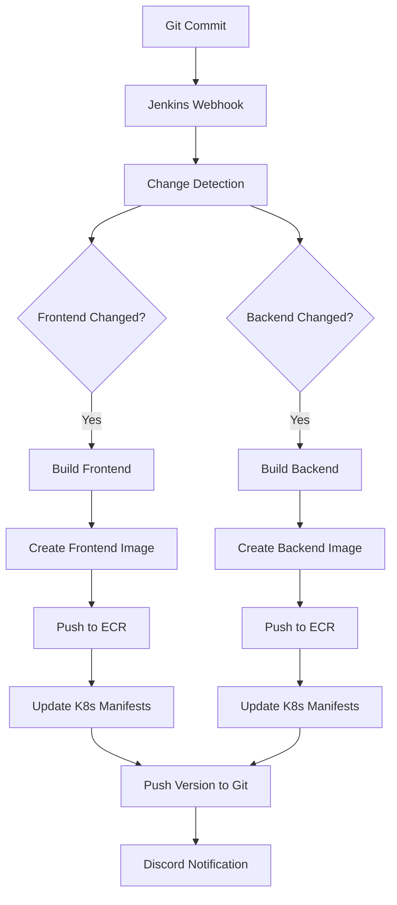

# CI/CD Pipeline Documentation

This document provides a comprehensive overview of the Jenkins CI/CD pipeline implementation for the ITI E-Commerce Platform project.

## Table of Contents

- [Overview](#overview)
- [Pipeline Architecture](#pipeline-architecture)
- [Jenkinsfile Configuration](#jenkinsfile-configuration)
- [Pipeline Stages](#pipeline-stages)
- [Shared Library Integration](#shared-library-integration)
- [Docker Integration](#docker-integration)
- [Kubernetes Deployment](#kubernetes-deployment)
- [Notification System](#notification-system)
- [Best Practices](#best-practices)
- [Troubleshooting](#troubleshooting)

## Overview

The CI/CD pipeline is implemented using Jenkins with a declarative Jenkinsfile that provides:
- **Automated building** of frontend and backend applications
- **Change detection** to build only modified components
- **Docker image creation** and pushing to ECR
- **Kubernetes manifest updates** for GitOps workflow
- **Discord notifications** for build status
- **Version management** with automatic incrementing

## Pipeline Architecture



## Jenkinsfile Configuration

### Environment Setup
```groovy
environment {
   DISCORD_WEBHOOK_URL = credentials('discord')
   CI = 'false'
}

tools {
    nodejs 'my-nodejs'
}
```

### Agent Configuration
- **Agent**: any (can run on any available Jenkins agent)
- **Tools**: Node.js runtime for building JavaScript applications

## Pipeline Stages

### 1. Detect Changes
**Purpose**: Determine which components have been modified to optimize build process.

```groovy
stage("Detect Changes"){
    steps{
        script {
            def changes = sh(script: 'git diff --name-only HEAD~1', returnStdout: true).trim()
            env.BUILD_FRONTEND = changes.contains('frontend/') ? 'true' : 'false'
            env.BUILD_BACKEND = changes.contains('backend/') ? 'true' : 'false'
        }
    }
}
```

**Key Features:**
- Compares current commit with previous commit
- Sets environment variables for conditional execution
- Optimizes build time by only building changed components

### 2. Build Frontend
**Purpose**: Build the React frontend application when frontend changes are detected.

**Conditions**: Executes only when `BUILD_FRONTEND` is 'true'

**Actions:**
- Navigate to frontend directory
- Execute Node.js build process using shared library
- Increment version number automatically

### 3. Build Backend
**Purpose**: Build the Node.js backend application when backend changes are detected.

**Conditions**: Executes only when `BUILD_BACKEND` is 'true'

**Actions:**
- Navigate to backend directory
- Execute Node.js build process using shared library
- Increment version number automatically

### 4. Build Docker Images

#### Backend Image Build
```groovy
stage("build backend image"){
    when {
        anyOf {
            environment name: 'BUILD_BACKEND', value: 'true'
        }
    }
    steps{
        script {
            dir('backend'){
                def version = getVersionFromPackageJson()
                buildImage "public.ecr.aws/b0b6i8m2/iti-project-backend:${version}"
            }
        }
    }
}
```

#### Frontend Image Build
```groovy
stage("build frontend image"){
    when {
        anyOf {
            environment name: 'BUILD_FRONTEND', value: 'true'
        }
    }
    steps{
        script {
            dir('frontend') {
                def version = getVersionFromPackageJson()
                buildImage "public.ecr.aws/b0b6i8m2/iti-project-frontend:${version}"
            }
        }
    }
}
```

**Key Features:**
- Conditional execution based on changes
- Dynamic version tagging from package.json
- AWS ECR public registry integration
- Multi-stage Docker builds for optimization

### 5. Push Docker Images

#### Push Frontend Image
- Pushes built frontend image to ECR
- Uses version from package.json as tag
- Conditional execution when frontend changes

#### Push Backend Image
- Pushes built backend image to ECR
- Uses version from package.json as tag
- Conditional execution when backend changes

### 6. Update Kubernetes Manifests

#### Update Backend Manifest
```groovy
stage("update backend k8s manifest"){
    steps{
        script {
            def version
            dir('backend'){
                version = getVersionFromPackageJson()
            }
            dir('k8s') {
                sh """
                    sed -i 's|image: public.ecr.aws/b0b6i8m2/iti-project-backend:.*|image: public.ecr.aws/b0b6i8m2/iti-project-backend:${version}|' 03-backend.yaml
                """
            }
        }
    }
}
```

#### Update Frontend Manifest
```groovy
stage("update frontend k8s manifest"){
    steps{
        script {
            def version
            dir('frontend'){
                version = getVersionFromPackageJson()
            }
            dir('k8s') {
                sh """
                    sed -i 's|image: public.ecr.aws/b0b6i8m2/iti-project-frontend:.*|image: public.ecr.aws/b0b6i8m2/iti-project-frontend:${version}|' 04-frontend.yaml
                """
            }
        }
    }
}
```

**Key Features:**
- Updates image tags in Kubernetes manifests
- Uses sed command for precise string replacement
- Enables GitOps workflow by updating manifests in repository

### 7. Push Version
**Purpose**: Commit and push updated versions back to the repository.

```groovy
stage("push version"){
    steps{
        script {
            pushVersionToGit()
        }
    }
}
```

## Shared Library Integration

The pipeline integrates with a Jenkins shared library hosted on GitLab:

```groovy
library 'identifier' : 'jenkins-shared-library@master','retriever': modernSCM(
    [
        $class: 'GitSCMSource',
        remote: 'https://gitlab.com/AbdelrahmanElshahat/jenkins-shared-library.git'
    ]
)
```

### Shared Library Functions Used:
1. **buildNodejs()**: Builds Node.js applications
2. **incrementNodejsVersion()**: Automatically increments package.json version
3. **getVersionFromPackageJson()**: Extracts version from package.json
4. **buildImage()**: Builds Docker images with standardized configuration
5. **dockerPush()**: Pushes images to container registry
6. **pushVersionToGit()**: Commits and pushes version updates

## Docker Integration

### Image Naming Convention
- **Backend**: `public.ecr.aws/b0b6i8m2/iti-project-backend:${version}`
- **Frontend**: `public.ecr.aws/b0b6i8m2/iti-project-frontend:${version}`

### Registry Configuration
- **Registry**: AWS ECR Public
- **Repository**: b0b6i8m2
- **Tagging**: Semantic versioning from package.json

## Kubernetes Deployment

### GitOps Workflow
1. Pipeline builds and pushes images
2. Updates Kubernetes manifests with new image tags
3. ArgoCD detects changes in Git repository
4. ArgoCD automatically deploys updated applications

### Manifest Files Updated
- `k8s/03-backend.yaml`: Backend deployment manifest
- `k8s/04-frontend.yaml`: Frontend deployment manifest

## Notification System

### Discord Integration
The pipeline sends detailed notifications to Discord using webhooks:

#### Success Notification
```json
{
    "embeds": [
        {
            "title": "✅ Pipeline Build Successful",
            "description": "Build completed successfully for: ${changesText}",
            "color": 65280,
            "fields": [
                {
                    "name": "Job Name",
                    "value": "${env.JOB_NAME}",
                    "inline": true
                },
                {
                    "name": "Build Number",
                    "value": "#${env.BUILD_NUMBER}",
                    "inline": true
                }
            ]
        }
    ]
}
```

#### Failure Notification
- **Color**: Red (16711680)
- **Title**: "❌ Pipeline Build Failed"
- **Additional Info**: Error details and build URL

#### Unstable Notification
- **Color**: Yellow (16776960)
- **Title**: "⚠️ Pipeline Build Unstable"
- **Purpose**: Warns about builds with warnings

### Notification Features
- **Rich embeds** with colors and icons
- **Build metadata** including duration and build number
- **Direct links** to Jenkins build logs
- **Component-specific** information about what was built

## Best Practices

### Change Detection
1. **Efficient Builds**: Only build components that have changed
2. **Resource Optimization**: Reduce unnecessary compute usage
3. **Faster Feedback**: Quicker build times for developers

### Version Management
1. **Semantic Versioning**: Automatic version incrementing
2. **Traceability**: Version tags correspond to Git commits
3. **Rollback Capability**: Easy to revert to previous versions

### Security
1. **Credentials Management**: Use Jenkins credentials store
2. **Secret Handling**: Environment variables for sensitive data
3. **Access Control**: Restrict pipeline execution permissions

### Monitoring
1. **Build Notifications**: Real-time status updates
2. **Failure Tracking**: Detailed error reporting
3. **Performance Metrics**: Build duration monitoring

## Troubleshooting

### Common Issues

#### Build Failures
1. **Node.js Dependency Issues**:
   ```bash
   # Solution: Clear npm cache
   npm cache clean --force
   ```

2. **Docker Build Failures**:
   ```bash
   # Solution: Check Dockerfile syntax and base images
   docker build --no-cache -t test-image .
   ```

3. **ECR Push Failures**:
   ```bash
   # Solution: Verify AWS credentials and repository permissions
   aws ecr get-login-password --region us-east-1
   ```

#### Manifest Update Issues
1. **Sed Command Failures**:
   - Verify file paths and permissions
   - Check regex patterns for accuracy
   - Ensure proper escaping of special characters

2. **Git Push Failures**:
   - Verify Git credentials configuration
   - Check repository permissions
   - Resolve merge conflicts if any

### Debugging Commands
```bash
# Check Jenkins agent connectivity
jenkins-agent status

# Verify Docker daemon
docker info

# Test ECR connectivity
aws ecr describe-repositories

# Check Kubernetes context
kubectl config current-context
```

### Log Analysis
1. **Jenkins Console Output**: Primary source for build logs
2. **Docker Build Logs**: Container creation details
3. **Git Operation Logs**: Version control activities
4. **Discord Webhook Logs**: Notification delivery status

## Configuration Files

### Jenkins Configuration
- **Global Tool Configuration**: Node.js installation
- **Credentials**: Discord webhook URL, AWS credentials
- **Plugin Requirements**: Pipeline, Docker, Git, Credentials

### Environment Variables
```groovy
environment {
    DISCORD_WEBHOOK_URL = credentials('discord')
    CI = 'false'
    BUILD_FRONTEND = 'false'  // Set dynamically
    BUILD_BACKEND = 'false'   // Set dynamically
}
```

### Required Jenkins Plugins
1. **Pipeline**: Core pipeline functionality
2. **Git**: Source code management
3. **Docker Pipeline**: Docker integration
4. **Credentials Binding**: Secure credential handling
5. **NodeJS**: Node.js build support

## Performance Optimization

### Build Optimization
1. **Parallel Stages**: Run independent stages concurrently
2. **Caching**: Docker layer caching, npm cache
3. **Selective Building**: Change detection prevents unnecessary builds

### Resource Management
1. **Agent Allocation**: Efficient use of build agents
2. **Cleanup**: Automatic workspace cleanup after builds
3. **Timeout Configuration**: Prevent hanging builds

## Security Considerations

### Secrets Management
- Use Jenkins credentials store for sensitive data
- Avoid hardcoding secrets in Jenkinsfile
- Implement principle of least privilege

### Access Control
- Configure appropriate user permissions
- Implement approval processes for production deployments
- Audit pipeline execution logs

### Network Security
- Secure communication with ECR
- VPN or private network access where possible
- Regular security updates for Jenkins and plugins

## Additional Resources

- [Jenkins Pipeline Documentation](https://www.jenkins.io/doc/book/pipeline/)
- [AWS ECR User Guide](https://docs.aws.amazon.com/ecr/latest/userguide/)
- [Docker Best Practices](https://docs.docker.com/develop/dev-best-practices/)
- [GitOps Principles](https://www.gitops.tech/)
