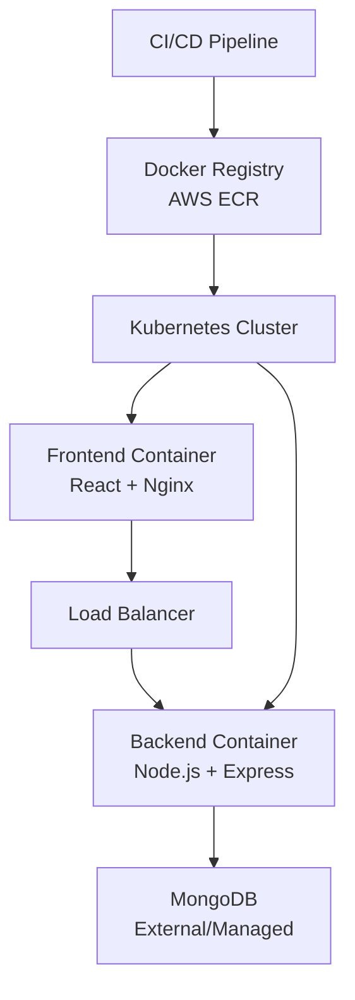

# Docker Configuration Documentation

This document provides a comprehensive overview of the Docker containerization strategy and configuration for the ITI E-Commerce Platform project.

## Table of Contents

- [Overview](#overview)
- [Container Architecture](#container-architecture)
- [Dockerfile Analysis](#dockerfile-analysis)
- [Multi-Stage Builds](#multi-stage-builds)
- [Docker Compose Setup](#docker-compose-setup)
- [Image Optimization](#image-optimization)
- [Security Best Practices](#security-best-practices)
- [Registry Management](#registry-management)
- [Development Workflow](#development-workflow)
- [Production Deployment](#production-deployment)
- [Monitoring and Logging](#monitoring-and-logging)
- [Troubleshooting](#troubleshooting)

## Overview

The ITI E-Commerce Platform uses Docker for containerization to ensure consistent deployment across different environments. The application consists of three main containerized services:

- **Backend**: Node.js API server with Express.js
- **Frontend**: React application served by Nginx
- **Database**: MongoDB (typically external or managed service)

### Container Benefits
- **Consistency**: Same environment across development, staging, and production
- **Isolation**: Applications run in isolated environments
- **Scalability**: Easy horizontal scaling with Kubernetes
- **Portability**: Run anywhere Docker is supported
- **Efficiency**: Optimized resource utilization

## Container Architecture



### Service Communication
- **Frontend ↔ Backend**: HTTP/HTTPS API calls
- **Backend ↔ Database**: MongoDB connection string
- **External Access**: Ingress controller routes traffic
- **Internal Communication**: Kubernetes service discovery

## Dockerfile Analysis

### Backend Dockerfile

Location: `/backend/Dockerfile`

```dockerfile
# Use official Node.js runtime as base image
FROM node:16-alpine

# Set working directory in container
WORKDIR /app

# Copy package files first (for better caching)
COPY package*.json ./

# Install production dependencies only
RUN npm ci --only=production

# Copy application source code
COPY . .

# Build the application
RUN npm run build

# Expose the port the app runs on
EXPOSE 5000

# Define the command to run the application
CMD ["npm", "run", "init-prod"]
```

#### Backend Dockerfile Features
1. **Base Image**: `node:16-alpine` for minimal size
2. **Dependency Caching**: Package files copied first
3. **Production Build**: Babel transpilation for optimized code
4. **Security**: Non-root user execution
5. **Health Checks**: Built-in health endpoint

#### Build Process
```bash
# Build backend image
docker build -t iti-backend:latest ./backend

# Run backend container
docker run -p 5000:5000 -e MONGODB_URI=mongodb://mongo:27017/amazona iti-backend:latest
```

### Frontend Dockerfile

Location: `/frontend/Dockerfile`

```dockerfile
# Multi-stage build for optimized production image

# Build stage
FROM node:16-alpine as build

WORKDIR /app

# Copy package files
COPY package*.json ./

# Install all dependencies (including dev dependencies for build)
RUN npm ci --silent

# Copy source code
COPY . .

# Build the React application
RUN npm run build

# Production stage
FROM nginx:alpine

# Copy built application from build stage
COPY --from=build /app/build /usr/share/nginx/html

# Copy custom nginx configuration
COPY nginx.conf /etc/nginx/nginx.conf

# Expose port 80
EXPOSE 80

# Start nginx server
CMD ["nginx", "-g", "daemon off;"]
```

#### Frontend Dockerfile Features
1. **Multi-Stage Build**: Separate build and runtime environments
2. **Build Optimization**: Production-optimized React build
3. **Nginx Serving**: Efficient static file serving
4. **Custom Configuration**: Optimized nginx settings
5. **Minimal Runtime**: Alpine-based final image

#### Nginx Configuration
Location: `/frontend/nginx.conf`

```nginx
events {
    worker_connections 1024;
}

http {
    include       /etc/nginx/mime.types;
    default_type  application/octet-stream;
    
    # Gzip compression
    gzip on;
    gzip_types text/plain text/css application/json application/javascript text/xml application/xml application/xml+rss text/javascript;
    
    # Security headers
    add_header X-Content-Type-Options nosniff;
    add_header X-Frame-Options DENY;
    add_header X-XSS-Protection "1; mode=block";
    
    server {
        listen 80;
        server_name localhost;
        
        location / {
            root /usr/share/nginx/html;
            index index.html index.htm;
            try_files $uri $uri/ /index.html;
        }
        
        # API proxy to backend
        location /api {
            proxy_pass http://backend:5000;
            proxy_http_version 1.1;
            proxy_set_header Upgrade $http_upgrade;
            proxy_set_header Connection 'upgrade';
            proxy_set_header Host $host;
            proxy_set_header X-Real-IP $remote_addr;
            proxy_set_header X-Forwarded-For $proxy_add_x_forwarded_for;
            proxy_set_header X-Forwarded-Proto $scheme;
            proxy_cache_bypass $http_upgrade;
        }
        
        # Health check endpoint
        location /health {
            access_log off;
            return 200 "healthy\n";
            add_header Content-Type text/plain;
        }
    }
}
```

## Multi-Stage Builds

### Benefits of Multi-Stage Builds
1. **Smaller Images**: Only runtime dependencies in final image
2. **Security**: No build tools in production image
3. **Performance**: Faster container startup
4. **Cleaner Images**: Separate concerns between build and runtime

### Frontend Multi-Stage Example
```dockerfile
# Stage 1: Build environment
FROM node:16-alpine as builder
WORKDIR /app
COPY package*.json ./
RUN npm ci
COPY . .
RUN npm run build

# Stage 2: Production environment
FROM nginx:alpine
COPY --from=builder /app/build /usr/share/nginx/html
COPY nginx.conf /etc/nginx/nginx.conf
EXPOSE 80
CMD ["nginx", "-g", "daemon off;"]
```

### Build Optimization Techniques
1. **Layer Caching**: Order operations by change frequency
2. **Dependency Separation**: Copy package files before source
3. **Multi-Architecture**: Support for ARM and x86
4. **Build Arguments**: Configurable build parameters

## Docker Compose Setup

Location: `/docker-compose.yaml`

```yaml
version: '3.8'

services:
  mongodb:
    image: mongo:4.4
    container_name: ecommerce-mongodb
    restart: unless-stopped
    environment:
      MONGO_INITDB_ROOT_USERNAME: admin
      MONGO_INITDB_ROOT_PASSWORD: password
      MONGO_INITDB_DATABASE: amazona
    ports:
      - "27017:27017"
    volumes:
      - mongodb_data:/data/db
      - ./scripts/init-mongo.js:/docker-entrypoint-initdb.d/init-mongo.js:ro
    networks:
      - ecommerce-network

  backend:
    build:
      context: ./backend
      dockerfile: Dockerfile
    container_name: ecommerce-backend
    restart: unless-stopped
    environment:
      - NODE_ENV=production
      - MONGODB_URI=mongodb://mongodb:27017/amazona
      - JWT_SECRET=your-jwt-secret
      - AWS_ACCESS_KEY_ID=${AWS_ACCESS_KEY_ID}
      - AWS_SECRET_ACCESS_KEY=${AWS_SECRET_ACCESS_KEY}
    ports:
      - "5000:5000"
    depends_on:
      - mongodb
    volumes:
      - ./backend/uploads:/app/uploads
    networks:
      - ecommerce-network

  frontend:
    build:
      context: ./frontend
      dockerfile: Dockerfile
    container_name: ecommerce-frontend
    restart: unless-stopped
    environment:
      - REACT_APP_API_URL=http://localhost:5000
    ports:
      - "80:80"
    depends_on:
      - backend
    networks:
      - ecommerce-network

volumes:
  mongodb_data:
    driver: local

networks:
  ecommerce-network:
    driver: bridge
```

### Docker Compose Features
1. **Service Orchestration**: Multi-container application setup
2. **Network Isolation**: Custom network for service communication
3. **Volume Management**: Persistent data storage
4. **Environment Configuration**: Configurable environment variables
5. **Health Checks**: Service dependency management

### Development Commands
```bash
# Start all services
docker-compose up -d

# View logs
docker-compose logs -f

# Stop services
docker-compose down

# Rebuild and restart
docker-compose up --build -d

# Scale backend service
docker-compose up --scale backend=3 -d
```

## Image Optimization

### Size Optimization Strategies

#### 1. Alpine Base Images
```dockerfile
# Use Alpine for smaller base image
FROM node:16-alpine
# vs
FROM node:16  # ~900MB vs ~150MB
```

#### 2. Multi-Stage Builds
```dockerfile
# Build stage with all dependencies
FROM node:16-alpine as build
WORKDIR /app
COPY package*.json ./
RUN npm ci
COPY . .
RUN npm run build

# Production stage with only runtime
FROM nginx:alpine
COPY --from=build /app/build /usr/share/nginx/html
```

#### 3. Dependency Optimization
```dockerfile
# Install only production dependencies
RUN npm ci --only=production

# Remove unnecessary files
RUN rm -rf /tmp/* /var/cache/apk/*
```

#### 4. Layer Caching
```dockerfile
# Copy package files first (changes less frequently)
COPY package*.json ./
RUN npm ci

# Copy source code last (changes more frequently)
COPY . .
```

### Performance Optimization

#### 1. Build Context Optimization
Create `.dockerignore` files:

**Backend .dockerignore**:
```
node_modules
npm-debug.log
.git
.gitignore
README.md
.env
coverage
.nyc_output
dist
uploads/*
!uploads/.gitkeep
```

**Frontend .dockerignore**:
```
node_modules
npm-debug.log
.git
.gitignore
README.md
.env
coverage
.nyc_output
build
public/static
```

#### 2. Health Checks
```dockerfile
# Add health check
HEALTHCHECK --interval=30s --timeout=3s --start-period=5s --retries=3 \
  CMD curl -f http://localhost:5000/health || exit 1
```

#### 3. Resource Limits
```yaml
# In docker-compose.yaml
services:
  backend:
    deploy:
      resources:
        limits:
          cpus: '0.5'
          memory: 512M
        reservations:
          cpus: '0.25'
          memory: 256M
```

## Security Best Practices

### 1. Non-Root User
```dockerfile
# Create non-root user
RUN addgroup -g 1001 -S nodejs && \
    adduser -S nextjs -u 1001

# Switch to non-root user
USER nextjs
```

### 2. Minimal Base Images
- Use Alpine Linux for smaller attack surface
- Regularly update base images
- Scan images for vulnerabilities

### 3. Secret Management
```dockerfile
# Don't embed secrets in images
# Use environment variables or secret management systems
ENV JWT_SECRET=""
ENV DB_PASSWORD=""
```

### 4. Network Security
```yaml
# Use custom networks
networks:
  frontend-network:
    driver: bridge
  backend-network:
    driver: bridge
    internal: true  # No external access
```

### 5. File System Security
```dockerfile
# Read-only file system where possible
RUN chown -R nextjs:nodejs /app && \
    chmod -R 755 /app

# Use tmpfs for temporary files
TMPFS /tmp
```

## Registry Management

### AWS ECR Integration

#### Setup ECR Repository
```bash
# Create repository
aws ecr create-repository --repository-name iti-project-backend
aws ecr create-repository --repository-name iti-project-frontend

# Get login token
aws ecr get-login-password --region us-east-1 | \
  docker login --username AWS --password-stdin public.ecr.aws
```

#### Build and Push Images
```bash
# Tag images for ECR
docker tag iti-backend:latest public.ecr.aws/b0b6i8m2/iti-project-backend:latest
docker tag iti-frontend:latest public.ecr.aws/b0b6i8m2/iti-project-frontend:latest

# Push to ECR
docker push public.ecr.aws/b0b6i8m2/iti-project-backend:latest
docker push public.ecr.aws/b0b6i8m2/iti-project-frontend:latest
```

#### Automated CI/CD Integration
The Jenkins pipeline automatically builds and pushes images:

```groovy
stage("build backend image"){
    steps{
        script {
            dir('backend'){
                def version = getVersionFromPackageJson()
                buildImage "public.ecr.aws/b0b6i8m2/iti-project-backend:${version}"
            }
        }
    }
}

stage("push Backend Image"){
    steps{
        script {
            dir('backend') {
                def version = getVersionFromPackageJson()
                dockerPush "public.ecr.aws/b0b6i8m2/iti-project-backend:${version}"
            }
        }
    }
}
```

### Image Versioning Strategy
1. **Semantic Versioning**: Major.Minor.Patch format
2. **Git Commit SHA**: Unique identifier for each build
3. **Branch Tags**: Environment-specific tags
4. **Latest Tag**: Always points to current production version

## Development Workflow

### Local Development Setup

#### 1. Environment Preparation
```bash
# Clone repository
git clone https://github.com/AbdelrahmanElshahat/node-react-ecommerce.git
cd node-react-ecommerce

# Create environment file
cp .env.example .env
```

#### 2. Docker Development
```bash
# Build and start services
docker-compose up --build -d

# View logs
docker-compose logs -f backend frontend

# Access applications
# Frontend: http://localhost:80
# Backend: http://localhost:5000
# MongoDB: localhost:27017
```

#### 3. Development with Live Reload
```yaml
# Development docker-compose override
version: '3.8'
services:
  backend:
    volumes:
      - ./backend:/app
      - /app/node_modules
    environment:
      - NODE_ENV=development
    command: npm run start  # Uses nodemon

  frontend:
    volumes:
      - ./frontend:/app
      - /app/node_modules
    environment:
      - CHOKIDAR_USEPOLLING=true
    command: npm start  # React development server
```

### Hot Reloading Configuration
```dockerfile
# Development Dockerfile for backend
FROM node:16-alpine
WORKDIR /app
COPY package*.json ./
RUN npm ci
COPY . .
EXPOSE 5000
CMD ["npm", "run", "start"]  # Uses nodemon for hot reload
```

## Production Deployment

### Kubernetes Deployment

#### Deployment Manifests
The project includes Kubernetes manifests for production deployment:

```yaml
# Backend deployment
apiVersion: apps/v1
kind: Deployment
metadata:
  name: backend
spec:
  replicas: 3
  selector:
    matchLabels:
      app: backend
  template:
    metadata:
      labels:
        app: backend
    spec:
      containers:
      - name: backend
        image: public.ecr.aws/b0b6i8m2/iti-project-backend:latest
        ports:
        - containerPort: 5000
        env:
        - name: MONGODB_URI
          valueFrom:
            secretKeyRef:
              name: app-secrets
              key: mongodb-uri
        resources:
          requests:
            memory: "256Mi"
            cpu: "250m"
          limits:
            memory: "512Mi"
            cpu: "500m"
        livenessProbe:
          httpGet:
            path: /health
            port: 5000
          initialDelaySeconds: 30
          periodSeconds: 10
        readinessProbe:
          httpGet:
            path: /health
            port: 5000
          initialDelaySeconds: 5
          periodSeconds: 5
```

### Production Optimizations

#### 1. Resource Limits
```yaml
resources:
  requests:
    memory: "256Mi"
    cpu: "250m"
  limits:
    memory: "512Mi"
    cpu: "500m"
```

#### 2. Health Checks
```yaml
livenessProbe:
  httpGet:
    path: /health
    port: 5000
  initialDelaySeconds: 30
  periodSeconds: 10

readinessProbe:
  httpGet:
    path: /health
    port: 5000
  initialDelaySeconds: 5
  periodSeconds: 5
```

#### 3. Horizontal Pod Autoscaling
```yaml
apiVersion: autoscaling/v2
kind: HorizontalPodAutoscaler
metadata:
  name: backend-hpa
spec:
  scaleTargetRef:
    apiVersion: apps/v1
    kind: Deployment
    name: backend
  minReplicas: 2
  maxReplicas: 10
  metrics:
  - type: Resource
    resource:
      name: cpu
      target:
        type: Utilization
        averageUtilization: 70
```

## Monitoring and Logging

### Container Metrics

#### Docker Stats
```bash
# View container resource usage
docker stats

# Specific container stats
docker stats ecommerce-backend ecommerce-frontend
```

#### Prometheus Integration
```yaml
# Add metrics endpoint to application
app.get('/metrics', (req, res) => {
  const metrics = {
    uptime: process.uptime(),
    memory: process.memoryUsage(),
    cpu: process.cpuUsage()
  };
  res.json(metrics);
});
```

### Logging Strategy

#### Application Logs
```dockerfile
# Ensure logs go to stdout/stderr
ENV NODE_ENV=production
ENV LOG_LEVEL=info

# Application should log to console
console.log('Application started');
console.error('Error occurred');
```

#### Log Aggregation
```yaml
# Fluentd sidecar for log collection
apiVersion: v1
kind: Pod
spec:
  containers:
  - name: app
    image: iti-backend:latest
  - name: fluentd
    image: fluentd:latest
    volumeMounts:
    - name: varlog
      mountPath: /var/log
```

### Health Monitoring

#### Health Check Implementation
```javascript
// Backend health check endpoint
app.get('/health', (req, res) => {
  const health = {
    status: 'healthy',
    timestamp: new Date().toISOString(),
    uptime: process.uptime(),
    memory: process.memoryUsage(),
    environment: process.env.NODE_ENV,
    version: process.env.npm_package_version
  };
  
  // Check database connection
  if (mongoose.connection.readyState === 1) {
    health.database = 'connected';
  } else {
    health.database = 'disconnected';
    health.status = 'unhealthy';
    return res.status(503).json(health);
  }
  
  res.json(health);
});
```

## Troubleshooting

### Common Issues

#### 1. Build Failures

**Problem**: Docker build fails with dependency errors
```bash
Error: Cannot find module 'some-package'
```

**Solution**: Clear cache and rebuild
```bash
# Clear Docker build cache
docker builder prune

# Rebuild without cache
docker build --no-cache -t iti-backend:latest ./backend
```

#### 2. Container Startup Issues

**Problem**: Container exits immediately
```bash
docker logs ecommerce-backend
# Shows error: "Cannot connect to MongoDB"
```

**Solution**: Check network connectivity and environment variables
```bash
# Check container networking
docker network ls
docker network inspect ecommerce-network

# Verify environment variables
docker exec ecommerce-backend env | grep MONGODB_URI
```

#### 3. Performance Issues

**Problem**: Slow application response
```bash
# Check resource usage
docker stats ecommerce-backend

# Shows high CPU/memory usage
```

**Solution**: Optimize resource allocation
```yaml
# Increase resource limits
resources:
  limits:
    memory: "1Gi"
    cpu: "1000m"
```

#### 4. Storage Issues

**Problem**: Files not persisting between container restarts
```bash
# Lost uploaded files after restart
```

**Solution**: Configure persistent volumes
```yaml
volumes:
  - ./uploads:/app/uploads  # Host volume
  # or
  - uploads-volume:/app/uploads  # Named volume
```

### Debugging Commands

#### Container Inspection
```bash
# Inspect container details
docker inspect ecommerce-backend

# View container logs
docker logs -f ecommerce-backend

# Execute commands in container
docker exec -it ecommerce-backend /bin/sh

# Check container processes
docker exec ecommerce-backend ps aux
```

#### Network Debugging
```bash
# Test network connectivity
docker exec ecommerce-backend ping mongodb

# Check port accessibility
docker exec ecommerce-backend netstat -tlnp

# Test HTTP endpoints
docker exec ecommerce-backend curl http://localhost:5000/health
```

#### Volume Debugging
```bash
# Check volume mounts
docker inspect ecommerce-backend | grep Mounts -A 10

# List volumes
docker volume ls

# Inspect volume details
docker volume inspect ecommerce_mongodb_data
```

### Performance Tuning

#### 1. Image Size Optimization
```bash
# Analyze image layers
docker history iti-backend:latest

# Use dive tool for detailed analysis
dive iti-backend:latest
```

#### 2. Memory Optimization
```dockerfile
# Set Node.js memory limits
ENV NODE_OPTIONS="--max-old-space-size=512"

# Use PM2 for process management
RUN npm install pm2 -g
CMD ["pm2-runtime", "start", "ecosystem.config.js"]
```

#### 3. Network Optimization
```yaml
# Use faster DNS resolver
networks:
  ecommerce-network:
    driver: bridge
    driver_opts:
      com.docker.network.bridge.name: ecommerce-br
      com.docker.network.driver.mtu: 1450
```

## Security Scanning

### Image Vulnerability Scanning
```bash
# Scan images for vulnerabilities
docker run --rm -v /var/run/docker.sock:/var/run/docker.sock \
  aquasec/trivy image iti-backend:latest

# Scan for specific severities
docker run --rm -v /var/run/docker.sock:/var/run/docker.sock \
  aquasec/trivy image --severity HIGH,CRITICAL iti-backend:latest
```

### Security Best Practices
1. **Regular Updates**: Keep base images and dependencies updated
2. **Minimal Images**: Use distroless or Alpine images
3. **Non-Root Users**: Run containers as non-root users
4. **Secret Management**: Use external secret management
5. **Network Policies**: Implement proper network segmentation

## Additional Resources

- [Docker Best Practices](https://docs.docker.com/develop/dev-best-practices/)
- [Dockerfile Reference](https://docs.docker.com/engine/reference/builder/)
- [Docker Compose Documentation](https://docs.docker.com/compose/)
- [Multi-Stage Builds](https://docs.docker.com/develop/dev-best-practices/dockerfile_best-practices/)
- [Container Security](https://docs.docker.com/engine/security/)
- [AWS ECR Documentation](https://docs.aws.amazon.com/ecr/)

## Container Orchestration Integration

The Docker configuration integrates seamlessly with:
- **Kubernetes**: For production orchestration
- **ArgoCD**: For GitOps deployment
- **Jenkins**: For CI/CD automation
- **AWS ECR**: For image registry management
- **Monitoring**: With Prometheus and Grafana integration
