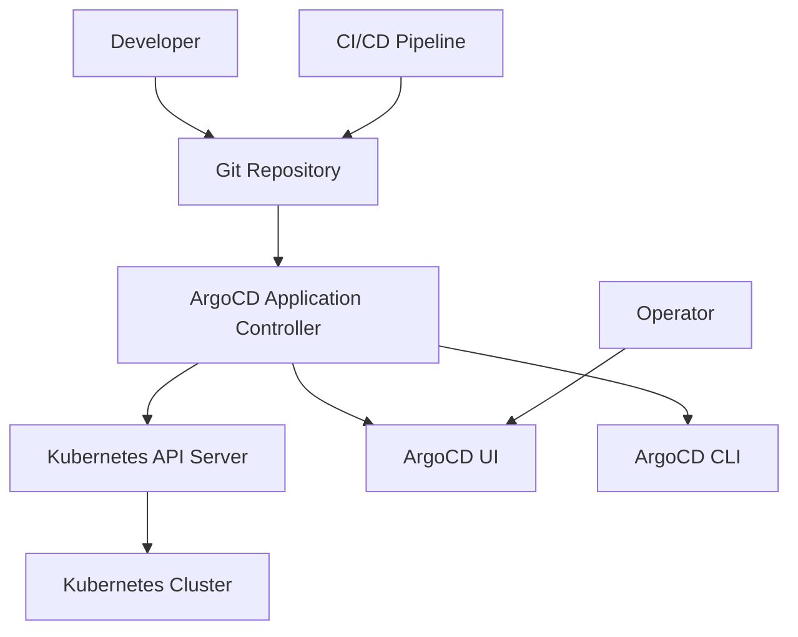

# GitOps and ArgoCD Documentation

This document provides a comprehensive overview of the GitOps implementation using ArgoCD for continuous deployment of the ITI E-Commerce Platform project.

## Table of Contents

- [Overview](#overview)
- [GitOps Principles](#gitops-principles)
- [ArgoCD Architecture](#argocd-architecture)
- [Application Configuration](#application-configuration)
- [Sync Policies](#sync-policies)
- [Installation and Setup](#installation-and-setup)
- [Application Management](#application-management)
- [Monitoring and Observability](#monitoring-and-observability)
- [Security and Access Control](#security-and-access-control)
- [Troubleshooting](#troubleshooting)
- [Best Practices](#best-practices)

## Overview

GitOps is a modern DevOps practice that uses Git repositories as the single source of truth for infrastructure and application deployment. ArgoCD is the GitOps operator that continuously monitors the Git repository and automatically synchronizes the cluster state with the desired state defined in Git.

### Key Benefits
- **Declarative Infrastructure**: All configurations stored in Git
- **Automated Deployments**: Continuous synchronization without manual intervention
- **Audit Trail**: Complete history of changes and deployments
- **Rollback Capability**: Easy reversion to previous states
- **Security**: Git-based access control and approval workflows

## GitOps Principles

### 1. Declarative Configuration
All system configuration is declared in Git repositories using Kubernetes manifests, providing a clear and versioned definition of the desired state.

### 2. Version Control
Git serves as the single source of truth, enabling:
- Change tracking and history
- Collaborative development
- Branching strategies for different environments
- Approval workflows through pull requests

### 3. Automated Deployment
ArgoCD continuously monitors Git repositories and automatically applies changes to the cluster when differences are detected.

### 4. Observability
Comprehensive monitoring and alerting provide visibility into:
- Deployment status and health
- Configuration drift detection
- Application performance metrics
- Security compliance

## ArgoCD Architecture

### Components Overview


### Core Components

#### 1. Application Controller
- Monitors Git repositories for changes
- Compares desired state (Git) with actual state (cluster)
- Orchestrates synchronization processes
- Manages application lifecycle

#### 2. Repository Server
- Caches Git repository contents
- Renders Kubernetes manifests from various sources
- Supports multiple Git authentication methods
- Handles repository access and credentials

#### 3. API Server
- Exposes ArgoCD functionality via REST API
- Manages application definitions and configurations
- Handles authentication and authorization
- Provides interface for UI and CLI

#### 4. Redis
- Caches application state and repository data
- Improves performance for frequent operations
- Stores temporary data and session information

## Application Configuration

### ArgoCD Application Manifest

The main application configuration is defined in `/argoCD/application.yaml`:

```yaml
apiVersion: argoproj.io/v1alpha1
kind: Application
metadata:
  name: ecommerce-app
  namespace: argocd
  labels:
    app: ecommerce
  finalizers:
    - resources-finalizer.argocd.argoproj.io
spec:
  project: default
  source:
    repoURL: https://github.com/AbdelrahmanElshahat/node-react-ecommerce.git
    targetRevision: main
    path: k8s
    directory:
      exclude: |
        ip-access-ingress.yaml
        argocd-ingress.yaml
        backend-nodeport.yaml
        **/test-*.yaml
        **/fix-*.yaml
  destination:
    server: https://kubernetes.default.svc
    namespace: ecommerce
  syncPolicy:
    automated:
      prune: true
      selfHeal: true
      allowEmpty: false
    syncOptions:
      - CreateNamespace=true
      - PrunePropagationPolicy=foreground
      - PruneLast=true
      - RespectIgnoreDifferences=true
      - ApplyOutOfSyncOnly=true
    retry:
      limit: 5
      backoff:
        duration: 5s
        factor: 2
        maxDuration: 3m
```

### Configuration Breakdown

#### Metadata Section
- **name**: `ecommerce-app` - Unique identifier for the application
- **namespace**: `argocd` - ArgoCD namespace where the application is managed
- **labels**: Application categorization and organization
- **finalizers**: Ensures proper cleanup when application is deleted

#### Source Configuration
- **repoURL**: Git repository containing Kubernetes manifests
- **targetRevision**: Branch or tag to track (main branch)
- **path**: Directory within repository containing manifests (k8s/)
- **directory.exclude**: Files and patterns to ignore during sync

#### Destination Configuration
- **server**: Kubernetes cluster API server URL
- **namespace**: Target namespace for application deployment (ecommerce)

## Sync Policies

### Automated Sync Policy
```yaml
syncPolicy:
  automated:
    prune: true           # Remove resources not in Git
    selfHeal: true        # Correct manual changes automatically
    allowEmpty: false     # Prevent empty applications
```

#### Policy Features
1. **Prune**: Automatically removes resources that are no longer defined in Git
2. **Self-Heal**: Reverts manual changes to maintain Git state
3. **Allow Empty**: Controls whether empty applications are permitted

### Sync Options
```yaml
syncOptions:
  - CreateNamespace=true              # Create namespace if it doesn't exist
  - PrunePropagationPolicy=foreground # Wait for resource deletion
  - PruneLast=true                    # Prune resources after sync
  - RespectIgnoreDifferences=true     # Honor ignore differences config
  - ApplyOutOfSyncOnly=true          # Only sync out-of-sync resources
```

### Retry Configuration
```yaml
retry:
  limit: 5              # Maximum retry attempts
  backoff:
    duration: 5s        # Initial retry delay
    factor: 2           # Exponential backoff factor
    maxDuration: 3m     # Maximum retry delay
```

### Ignore Differences
```yaml
ignoreDifferences:
  - group: apps
    kind: Deployment
    jsonPointers:
      - /spec/replicas    # Ignore replica count changes (HPA managed)
  - group: ""
    kind: Service
    jsonPointers:
      - /spec/clusterIP   # Ignore cluster IP assignments
  - group: networking.k8s.io
    kind: Ingress
    jsonPointers:
      - /status           # Ignore ingress status updates
```

## Installation and Setup

### Prerequisites
- Kubernetes cluster (1.20+)
- kubectl configured for cluster access
- Sufficient cluster resources (2 CPU, 4GB RAM minimum)

### ArgoCD Installation

#### Method 1: Standard Installation
```bash
# Create ArgoCD namespace
kubectl create namespace argocd

# Install ArgoCD
kubectl apply -n argocd -f https://raw.githubusercontent.com/argoproj/argo-cd/stable/manifests/install.yaml
```

#### Method 2: Using Helm
```bash
# Add ArgoCD Helm repository
helm repo add argo https://argoproj.github.io/argo-helm

# Install ArgoCD with custom values
helm install argocd argo/argo-cd -n argocd --create-namespace
```

#### Method 3: Project Installation Script
```bash
# Using project-specific installation script
cd k88s
./install-argocd.sh
```

### Initial Configuration

#### 1. Get Admin Password
```bash
# Get initial admin password
kubectl -n argocd get secret argocd-initial-admin-secret -o jsonpath="{.data.password}" | base64 -d
```

#### 2. Access ArgoCD UI
```bash
# Port forward to access UI
kubectl port-forward svc/argocd-server -n argocd 8080:443

# Access at https://localhost:8080
```

#### 3. Login with CLI
```bash
# Install ArgoCD CLI
curl -sSL -o argocd-linux-amd64 https://github.com/argoproj/argo-cd/releases/latest/download/argocd-linux-amd64
sudo install -m 555 argocd-linux-amd64 /usr/local/bin/argocd

# Login to ArgoCD
argocd login localhost:8080
```

### Application Deployment

#### 1. Deploy Application Definition
```bash
# Apply the application configuration
kubectl apply -f argoCD/application.yaml
```

#### 2. Verify Application Status
```bash
# Check application status
argocd app get ecommerce-app

# List all applications
argocd app list
```

#### 3. Manual Sync (if needed)
```bash
# Trigger manual sync
argocd app sync ecommerce-app

# Sync with prune
argocd app sync ecommerce-app --prune
```

## Application Management

### Application Lifecycle

#### 1. Creation
- Define application manifest
- Apply to ArgoCD namespace
- Initial synchronization

#### 2. Updates
- Git repository changes trigger automatic sync
- Manual sync available via UI or CLI
- Rollback to previous versions

#### 3. Monitoring
- Real-time status monitoring
- Health checks and readiness probes
- Resource utilization tracking

#### 4. Deletion
- Proper resource cleanup
- Finalizer handling
- Namespace cleanup

### CLI Operations

#### Application Management
```bash
# Create application
argocd app create ecommerce-app \
  --repo https://github.com/AbdelrahmanElshahat/node-react-ecommerce.git \
  --path k8s \
  --dest-server https://kubernetes.default.svc \
  --dest-namespace ecommerce

# Get application details
argocd app get ecommerce-app

# Show application history
argocd app history ecommerce-app

# Rollback to previous revision
argocd app rollback ecommerce-app <revision-id>

# Delete application
argocd app delete ecommerce-app
```

#### Sync Operations
```bash
# Sync application
argocd app sync ecommerce-app

# Sync with options
argocd app sync ecommerce-app --prune --strategy=apply

# Refresh application
argocd app refresh ecommerce-app
```

### UI Operations

#### Dashboard Features
- Application status overview
- Resource tree visualization
- Sync status and history
- Log viewing and debugging

#### Application Details
- Resource health status
- Configuration diff view
- Event timeline
- Sync operation progress

## Monitoring and Observability

### Application Health

#### Health Status Indicators
- **Healthy**: All resources running correctly
- **Progressing**: Deployment in progress
- **Degraded**: Some resources unhealthy
- **Suspended**: Application sync suspended
- **Missing**: Resources not found
- **Unknown**: Health status undetermined

#### Resource Status
```bash
# Check resource health
kubectl get applications -n argocd ecommerce-app -o yaml

# View resource tree
argocd app get ecommerce-app --output tree
```

### Sync Status

#### Sync States
- **Synced**: Cluster state matches Git state
- **OutOfSync**: Drift detected between Git and cluster
- **Unknown**: Unable to determine sync status

#### Sync Operations
```bash
# View sync status
argocd app get ecommerce-app --output json | jq '.status.sync'

# Check last sync operation
argocd app get ecommerce-app --output json | jq '.status.operationState'
```

### Metrics and Monitoring

#### Prometheus Integration
ArgoCD exports metrics for monitoring:
- Application sync status
- Repository connection health
- API server performance
- Controller metrics

#### Grafana Dashboards
- ArgoCD operational metrics
- Application deployment trends
- Resource utilization
- Error rate monitoring

### Notifications

#### Webhook Configuration
```yaml
apiVersion: v1
kind: ConfigMap
metadata:
  name: argocd-notifications-cm
  namespace: argocd
data:
  service.webhook.my-webhook: |
    url: https://webhook.example.com/webhook
    headers:
    - name: Content-Type
      value: application/json
```

#### Notification Triggers
- Sync operation completed
- Application health degraded
- Sync operation failed
- Application deleted

## Security and Access Control

### Authentication

#### OIDC Integration
```yaml
oidc.config: |
  name: OIDC
  issuer: https://your-oidc-provider.com
  clientId: argocd
  clientSecret: $oidc.clientSecret
  requestedScopes: ["openid", "profile", "email", "groups"]
```

#### LDAP Integration
```yaml
ldap:
  config: |
    host: ldap.example.com
    port: 389
    useSSL: false
    bindDN: cn=admin,dc=example,dc=com
    bindPassword: password
    searchBaseDN: dc=example,dc=com
    searchFilter: (uid={{.Input}})
```

### Authorization (RBAC)

#### Policy Configuration
```yaml
policy.default: role:readonly
policy.csv: |
  p, role:admin, applications, *, */*, allow
  p, role:admin, clusters, *, *, allow
  p, role:admin, repositories, *, *, allow
  
  p, role:developer, applications, get, default/*, allow
  p, role:developer, applications, sync, default/*, allow
  
  g, argocd-admins, role:admin
  g, developers, role:developer
```

#### Role Definitions
- **Admin**: Full access to all resources
- **Developer**: Limited access to specific applications
- **Readonly**: View-only access
- **Custom**: Tailored permissions based on requirements

### Secret Management

#### Git Repository Credentials
```bash
# Add Git repository with credentials
argocd repo add https://github.com/private/repo.git \
  --username git-user \
  --password git-token
```

#### Cluster Credentials
```bash
# Add external cluster
argocd cluster add my-cluster-context --name my-cluster
```

### Network Security

#### Ingress Configuration
```yaml
apiVersion: networking.k8s.io/v1
kind: Ingress
metadata:
  name: argocd-server-ingress
  namespace: argocd
  annotations:
    nginx.ingress.kubernetes.io/backend-protocol: "GRPC"
    nginx.ingress.kubernetes.io/ssl-redirect: "true"
spec:
  tls:
  - hosts:
    - argocd.example.com
    secretName: argocd-server-tls
  rules:
  - host: argocd.example.com
    http:
      paths:
      - path: /
        pathType: Prefix
        backend:
          service:
            name: argocd-server
            port:
              number: 443
```

## Troubleshooting

### Common Issues

#### 1. Application Stuck in Progressing State
```bash
# Check application events
kubectl describe application ecommerce-app -n argocd

# View controller logs
kubectl logs -f deployment/argocd-application-controller -n argocd

# Manual refresh
argocd app refresh ecommerce-app
```

#### 2. Sync Failures
```bash
# Check sync operation details
argocd app get ecommerce-app --output json | jq '.status.operationState'

# View detailed sync logs
argocd app sync ecommerce-app --dry-run

# Force sync with prune
argocd app sync ecommerce-app --force --prune
```

#### 3. Repository Connection Issues
```bash
# Test repository connectivity
argocd repo get https://github.com/AbdelrahmanElshahat/node-react-ecommerce.git

# Update repository credentials
argocd repo add https://github.com/AbdelrahmanElshahat/node-react-ecommerce.git \
  --username new-user \
  --password new-token \
  --upsert
```

#### 4. Resource Health Issues
```bash
# Check resource status in target namespace
kubectl get all -n ecommerce

# Describe problematic resources
kubectl describe deployment backend -n ecommerce

# View pod logs
kubectl logs -f deployment/backend -n ecommerce
```

### Debugging Commands

#### ArgoCD Status
```bash
# Check ArgoCD components
kubectl get pods -n argocd

# View application controller logs
kubectl logs -f deployment/argocd-application-controller -n argocd

# Check API server logs
kubectl logs -f deployment/argocd-server -n argocd
```

#### Application Debugging
```bash
# Get application status
argocd app get ecommerce-app --hard-refresh

# Show application diff
argocd app diff ecommerce-app

# View application events
argocd app get ecommerce-app --output json | jq '.status.conditions'
```

## Best Practices

### Repository Structure
1. **Separate Repositories**: Keep application code and manifests separate
2. **Environment Branching**: Use branches for different environments
3. **Manifest Organization**: Organize manifests by application and environment
4. **Version Tagging**: Use semantic versioning for releases

### Application Design
1. **Resource Grouping**: Group related resources in single application
2. **Namespace Isolation**: Use separate namespaces for environments
3. **Health Checks**: Implement proper readiness and liveness probes
4. **Resource Limits**: Define appropriate resource requests and limits

### Security Practices
1. **Least Privilege**: Grant minimum required permissions
2. **Secret Management**: Use external secret managers
3. **Network Policies**: Implement network segmentation
4. **Regular Updates**: Keep ArgoCD and dependencies updated

### Operational Excellence
1. **Monitoring**: Implement comprehensive monitoring and alerting
2. **Backup Strategy**: Regular backup of ArgoCD configuration
3. **Disaster Recovery**: Plan for cluster and data recovery
4. **Documentation**: Maintain up-to-date documentation

### Performance Optimization
1. **Resource Sizing**: Appropriately size ArgoCD components
2. **Repository Caching**: Configure repository caching for performance
3. **Sync Frequency**: Optimize sync intervals based on requirements
4. **Resource Pruning**: Regularly clean up unused resources

## Integration with CI/CD

### Pipeline Integration
The GitOps workflow integrates with the Jenkins CI/CD pipeline:

1. **CI Pipeline**: Builds and tests application code
2. **Image Building**: Creates and pushes Docker images
3. **Manifest Update**: Updates Kubernetes manifests with new image tags
4. **Git Commit**: Commits updated manifests to repository
5. **ArgoCD Sync**: Automatically detects changes and deploys

### Webhook Configuration
```bash
# Configure Git webhook for immediate sync
argocd app patch ecommerce-app --patch '{"spec":{"source":{"repoURL":"https://github.com/AbdelrahmanElshahat/node-react-ecommerce.git","targetRevision":"main","path":"k8s"}}}'
```

## Multi-Environment Management

### Environment Strategy
```yaml
# Production application
apiVersion: argoproj.io/v1alpha1
kind: Application
metadata:
  name: ecommerce-prod
spec:
  source:
    targetRevision: release
    path: k8s/prod

# Staging application  
apiVersion: argoproj.io/v1alpha1
kind: Application
metadata:
  name: ecommerce-staging
spec:
  source:
    targetRevision: main
    path: k8s/staging
```

### Progressive Delivery
1. **Canary Deployments**: Gradual traffic shifting
2. **Blue-Green Deployments**: Zero-downtime deployments
3. **Feature Flags**: Runtime feature toggling
4. **A/B Testing**: User experience experimentation

## Additional Resources

- [ArgoCD Documentation](https://argo-cd.readthedocs.io/)
- [GitOps Principles](https://www.gitops.tech/)
- [Kubernetes GitOps Guide](https://kubernetes.io/docs/concepts/cluster-administration/gitops/)
- [CNCF GitOps Working Group](https://github.com/cncf/tag-app-delivery/tree/main/gitops-wg)
- [ArgoCD Best Practices](https://argoproj.github.io/argo-cd/operator-manual/declarative-setup/)

## Verification Scripts

The project includes several verification scripts in the `k88s/` directory:

### ArgoCD Verification
```bash
# Check ArgoCD installation
./verify-argocd.sh

# Get ArgoCD access information
./argocd-access-info.sh

# Check application status
./check-application.sh
```

### Application Verification
```bash
# Verify products API
./verify-products.sh

# Check API endpoints
./check-api-products.sh

# Test application access
./test-access.sh
```

These scripts provide automated verification of the GitOps deployment and application functionality.
